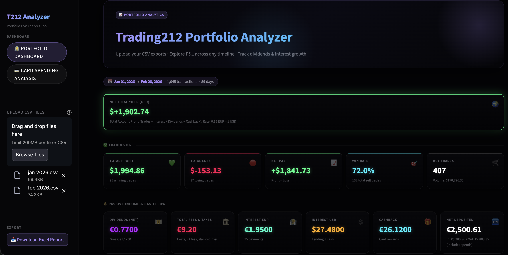
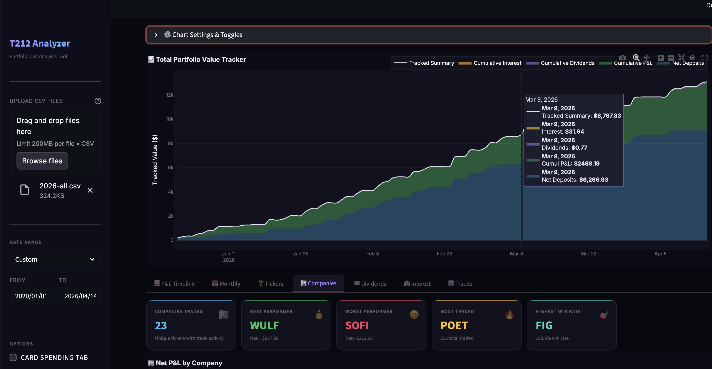
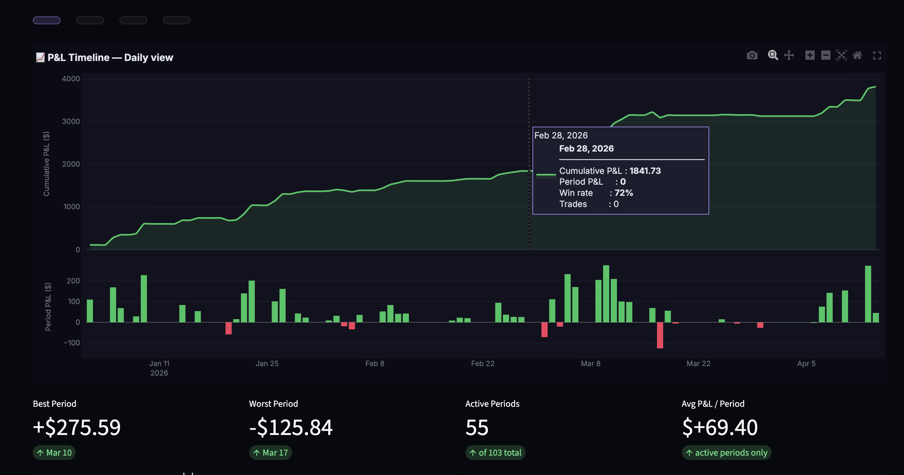
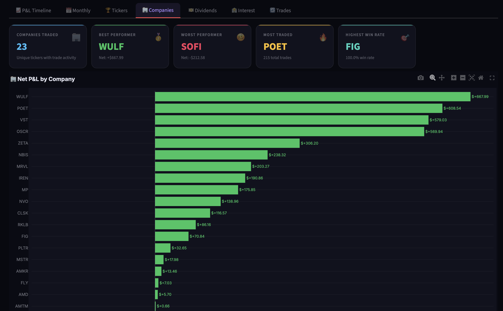
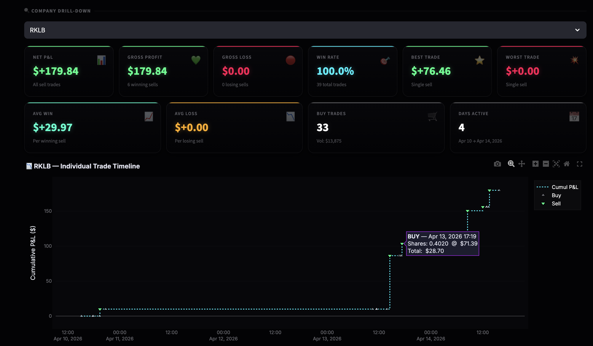
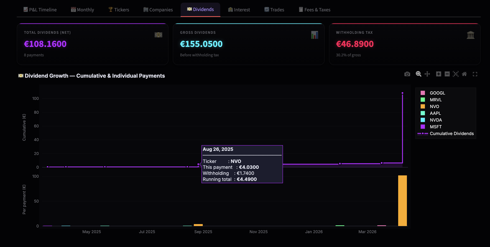
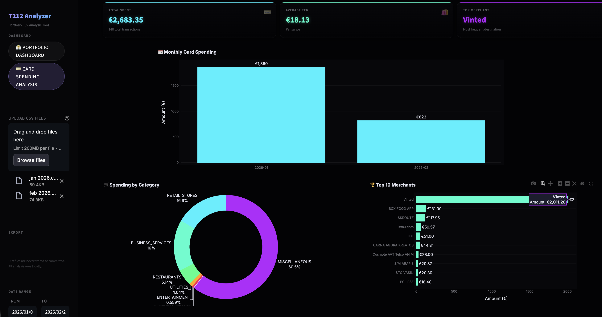

# Trading212 Portfolio & Card Analytics Terminal

> *"Local, secure portfolio and spending analyzer for Trading212. Built with Streamlit, it transforms raw CSV history exports into powerful visual insights, detailing trade win rates, Interest , Dividends , P&L efficiency, and granular merchant spending that the native app doesn't show you.."*



A high-performance **Streamlit** web application for visualizing your Trading212 portfolio and debit card activity.  
Upload one or more CSV files, pick a date range, and instantly unlock institutional-grade P&L breakdowns, yield tracking, and a deep per-company comparison — all wrapped in a premium dark UI.

---

## 🚀 The "Missing" Trading212 Insights
While the native Trading212 app is excellent for execution, its analytics are basic. This dashboard extracts and visualizes the raw data hidden within your export files to give you:
- **True Win Rates**: Know exactly how many sell trades resulted in a profit vs. a loss, and visualize your win-ratio per ticker.
- **Hidden Fees & Taxes**: See the exact aggregated total of FX fees, stamp duties, and hidden costs you've paid across your trading career.
- **Algorithmic P&L Correlation**: Scatter plot visualization showing Trade Volume vs. Total Trades vs. Net P&L to see if overtrading is hurting your returns.
- **Aggregated Net Deposits**: Flawless tracking of In/Out flows, automatically deducting your stock market withdrawals *and* your card spending.
- **Card Spending Analytics**: Beautiful categorizations of your Trading212 Visa/Mastercard debit expenses, top merchants, and spending velocity.

---

## 📊 Comprehensive Feature Breakdown

### 🏦 1. Main Dashboard & Portfolio Tracking
  
  
- **Main Progress Timeline**: A massive Total Portfolio Value Tracker showing the cumulative growth of your Net Deposits, Realized P&L, Dividends, and Interest layered together.

### 📅 2. Realized P&L Timeline
  
- **Dynamic Resolution**: Deep dive into your trading performance with Daily, Weekly, Monthly, or Quarterly resolutions. The top area chart tracks cumulative P&L growth, while bottom bars show period-by-period returns.

### 🏢 3. Companies Deep-Dive
  
- **Trades vs. P&L Matrix**: An interactive bubble chart mapping the number of trades against Net P&L. Bubble size denotes total capital deployed, while the color gradient represents absolute win-rate.
- **Market Rankings**: See your highest win-rate ticker, most traded company, and absolute best/worst performers. 

### 🔍 4. Granular Company Drill-Down
  
- **Trade-by-Trade View**: Select any individual stock to reveal its complete sequence of buys and sells on a single interactive timeline.
- **Multi-Line Comparables**: Select multiple companies to stack their running P&L timelines onto a single cross-comparison chart.

### 💵 5. Dividends & Interest Tracking
  
  
- **Passive Income Focus**: Watch your compound passive income grow with step-charts, cleanly splitting EUR and USD interest payments while tracking withholding taxes.

### 💳 6. Trading212 Card Spending Analyzer
  
The dashboard dynamically splits into a secondary "Card Spending" suite if it detects debit card activity within your CSVs.
- **Monthly Velocity**: Bar charts tracking your day-to-day debit card burn rate.
- **Merchant Profiling**: A horizontal leaderboard identifying your Top 10 most frequented merchants.
- **Category Donut**: A breakdown of your spending by internal Visa/Mastercard categories (e.g., Retail, Groceries, Restaurants). 
- **Cashback Metrics**: Fully integrates your cashback rewards into your overarching portfolio returns.

---

## 💾 Installation & Setup

### Prerequisites
- Python 3.9+
- A Trading212 Invest or ISA account (CSV export)

### Terminal Startup

```bash
# 1. Clone the repo
git clone https://github.com/kuriakosant/Trading212-Portfolio-CSV-Analyzer.git
cd Trading212-Portfolio-CSV-Analyzer

# 2. Create a virtual environment
python3 -m venv .venv
source .venv/bin/activate        # Windows: .venv\Scripts\activate

# 3. Install dependencies
pip install -r requirements.txt

# 4. Launch the app
streamlit run app.py
```

Then open **http://localhost:8501** in your browser.

---

## 🗄 Exporting your CSV from Trading212

1. Open the **Trading212** app (mobile or web)
2. Go to **Menu → History**
3. Click the **download / export icon** (top right)
4. Select your date range *(max 365 days per export)*
5. Tap **Export** — the CSV downloads to your device

> **Tip:** For multi-year history, export one year at a time. The sidebar uploader accepts multiple CSV files concurrently and will merge/de-duplicate them completely automatically!

---

## 🔒 Data Privacy & Security

- **No data eavesdropping.** The app runs completely locally on your own machine's Python environment.
- **CSV files are git-ignored** directly in the source control config. You cannot accidentally commit your financial data to GitHub.
- **Zero Telemetry.** No external API calls, no analytics tracking, no server-side renders.

---

## 📦 Supported Action Types

The backend parsing engine cleanly isolates the following CSV row identities:
- Market / Limit Buys (`buy`)
- Market / Limit Sells (`sell`)
- Dividends & Withholding Tax (`dividend`)
- Interest on Cash / Lending Interest (`interest`)
- Deposits & Withdrawals (`deposit` / `withdrawal`)
- Currency Conversion (`fx_conversion`)
- Debit Card Spending (`card_debit`)
- Card Refunds / Credits (`card_credit`)
- Spending Cashback (`cashback`)

## License
MIT — free to use, modify, and distribute.
